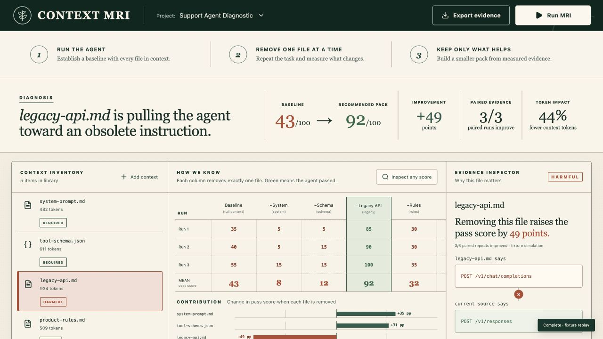

# Context MRI

**Find the context that is quietly breaking your AI agent.**

Context MRI is an evidence-first profiler for agent context. It runs a baseline, removes one context item at a time, repeats each condition, classifies every file from the measured score change, and verifies the recommended context pack with a final independent run.

The included Build Week example diagnoses an archived API guide that conflicts with the current tool schema. The baseline mean is **43/100**. Removing the stale guide scores **92/100**, and the recommended pack independently verifies at **92/100** with **44% fewer context tokens**.



## Judge quickstart

Requirements: macOS, Windows, or Linux; Node.js 20+; npm.

```bash
npm install
npm run dev
```

Open [http://localhost:5173](http://localhost:5173), then:

1. Read the three-step method at the top of the app.
2. Click **Run MRI**.
3. Click any matrix score to inspect its run ID, prompt hash, rubric, tokens, latency, output, and provenance.
4. Compare **Baseline** with **−Legacy API**.
5. Click **Remove from context pack**, then **Copy manifest**.
6. Preview the safe rewrite, stage it, and run the MRI again to verify the repair.
7. Use **Export evidence** to download the complete JSON ledger.

No API quota is required to judge the complete interface and workflow. Without quota, the server uses a clearly labeled deterministic **fixture simulation** of the bundled support-agent example. It is never represented as fresh model evidence. With a funded `OPENAI_API_KEY` in `.env.local`, the same endpoint automatically generates fresh GPT‑5.6 Sol traces instead.

```dotenv
OPENAI_API_KEY=your_key_here
```

Custom `.md`, `.json`, and `.txt` files can be added from the interface. Fixture mode exercises the dynamic variant, classification, trace, pack, and export pipeline; fresh claims about custom content require live API quota.

## Verification

```bash
npm test
npm run build
npm audit --audit-level=high
curl http://localhost:8787/api/health
```

## How the experiment works

For the five-item demo, Context MRI creates six discovery conditions: the full baseline plus one condition omitting each item. It runs each condition three times for **18 ablation traces**. It then builds a recommended pack from measured contribution and runs that pack three more times, producing **21 inspectable traces** total.

Each model output is scored from 0–100 by application code using a fixed rubric:

| Criterion | Points |
| --- | ---: |
| Correct current endpoint | 50 |
| Recognizes the current source | 20 |
| Handles the legacy instruction | 15 |
| Explains the conflict | 10 |
| Valid structured output | 5 |

For context item `i`:

```text
contribution(i) = mean(baseline) - mean(omit i)
```

Classification is derived—not supplied by the input:

| Contribution | Classification | Default action |
| ---: | --- | --- |
| `>= +20` | Required | Keep |
| `+5` to `+19` | Useful | Keep |
| `−4` to `+4` | Redundant | Optional/remove |
| `<= −5` | Harmful | Remove or rewrite |

Positive contribution means removing the file hurts the task. Negative contribution means the task improves without it. The interface describes this as controlled, task-specific evidence rather than universal causal proof.

## GPT‑5.6 and Codex

- The live subject uses the Responses API with `gpt-5.6-sol`, medium reasoning, and strict Structured Outputs.
- A one-call quota probe prevents the server from starting a full live suite when the project cannot run it.
- Codex was used for idea selection, official-requirement research, architecture, API implementation, tests, interaction design, mathematical consistency checks, and browser QA.
- GPT‑5.6 guidance shaped the product thesis: test leaner context by removing one instruction or tool group at a time and rerunning representative evals.
- Codex task/session ID: `019f71e4-f746-7083-a465-1c84948bbd8c`.

## Repository map

- `server/experiment-engine.ts` — live runner, fixture simulation, evaluator, classification, and pack verification
- `server/experiment-engine.test.ts` — evaluator, aggregation, classification, custom-context, and provenance invariants
- `src/components/Matrix.tsx` — ablation matrix, contribution plot, and verification result
- `src/components/Modals.tsx` — trace provenance, fixture explanation, and safe rewrite
- `samples/support-agent/` — human-readable demo bundle
- `submission/` — Devpost copy, demo script, and judging checklist
- `docs/ARCHITECTURE.md` — system design and trust boundaries

## Supported platforms

The browser app and Node server are platform-independent and have been verified locally on macOS. A judge can run the complete fixture workflow without creating an account, supplying a secret, or rebuilding external infrastructure.

## Honest limitations

- Three repeats establish directional stability for this demo, not statistical certainty.
- Single-item ablation can miss interactions between context files.
- Fixture results are a deterministic simulation of the bundled scenario, not fresh GPT‑5.6 traces.
- The included evaluator is intentionally task-specific; production use needs representative datasets and human-calibrated labels.
- Uploaded context is held only in browser memory for the current session.

## License

MIT. See [LICENSE](./LICENSE).
