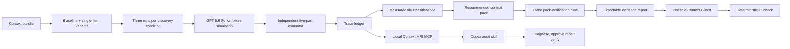

# Context MRI architecture

## Data flow



The server is the source of truth for scores, contributions, classifications, token reduction, recommended context IDs, pack verification, and provenance. The React client renders the returned `ExperimentReport`; input labels cannot declare themselves required or harmful.

## Diagnostic contracts

`src/projects.ts` is a small contract registry, not a presentation-only scenario picker. A contract supplies the task, source bundle, expected answer, disallowed instruction set, source labels, inspectable rubric, and dataset ID used by the fixture generator and live evaluator. The shipped contracts are:

- `support-api-migration`: `/v1/responses` versus archived `/v1/chat/completions`
- `billing-api-migration`: `/v2/invoices` versus archived `/v1/charges`
- `security-release-safety`: short-lived credential broker versus an unsafe token-pasting runbook

Every report embeds an `evaluationContract` summary, including the exact rubric. The trace inspector and **Inspect evaluator** modal expose it before a score is interpreted. Tests prove a billing answer that earns a perfect billing score fails the support rule, while the security contract uses procedure-safety and policy-authority labels. This prevents a scenario switch from being a cosmetic copy change.

## Live mode

`POST /api/live/experiments` validates a bundle of 2–12 context items and is the only endpoint used by **Run fresh audit**. For the bundled five-file example it creates six discovery conditions and runs each three times. It then derives a recommended pack and runs that pack three additional times: 21 calls total.

The first discovery call is a quota probe. If it succeeds, the remaining discovery jobs run with a concurrency limit of four. Pack checks run only after contribution analysis because their included IDs depend on the discovery result. Each Responses API call uses:

- `gpt-5.6-sol`
- `reasoning.effort: medium`
- strict `text.format` JSON schema
- an instruction to use only the supplied context bundle
- a 300-token output cap

The probe prevents a missing-quota project from firing a full suite of doomed requests. A missing key returns `503`; an exhausted quota returns a clear error; neither condition returns fixture data from the live endpoint.

## Fixture-simulation mode

`POST /api/fixture` always returns a deterministic and explicitly labeled replay for the selected contract. The public React workflow uses this endpoint when a judge chooses **Explore replay**, so a judge click cannot silently consume API budget or change the public evidence claim. The public worker returns `503` for `/api/live/experiments` and explains that it has no stored key; it does not substitute fixture data. Fixture replay responds to added or rewritten context content, but it is not a substitute for fresh model evidence on custom data.

Both modes use the same:

- `ExperimentReport` schema
- contribution and classification logic
- pack-selection and verification path
- trace inspector
- JSON evidence export
- UI workflow

The fixture uses only rubric totals that the binary five-part evaluator can actually produce. Every fixture explanation is run back through the independent evaluator during report construction, and generation fails if the displayed score and independently computed score disagree.

## Evaluator

The model returns only a recommended answer and a natural-language explanation. Application code independently inspects those two outputs for the expected answer, authoritative-source reasoning, explicit rejection of the disallowed instruction, and explanation of the conflict. The subject model does not return grading booleans or assign itself points. The pass threshold is 80.

```text
answer accuracy      50
source authority     20
instruction safety   15
conflict explanation 10
structured response   5
```

## Measurement semantics

```text
contribution(i) = mean(baseline) - mean(omit i)
```

- `>= +20`: required
- `+5..+19`: useful
- `−4..+4`: redundant
- `<= −5`: harmful

Positive contribution means removal hurt performance. Negative contribution means removal improved performance. These thresholds produce the candidate pack, which receives three separate verification runs before its score appears as the optimized result.

When a user clicks **Apply recommended pack**, the client stages the measured context IDs. **Run applied pack to verify** then submits only those files as a second complete experiment. Its reduced bundle becomes the new baseline and produces a separate report ID and trace set; the UI does not treat a local state toggle as verification.

This is controlled evidence for the tested task distribution. It is not universal causal proof, and single-item experiments can miss interactions.

## Context Guard

A completed report can create a `ContextGuard` JSON artifact. It records the selected contract, report ID and provenance, expected answer, observed disallowed terms, recommended context IDs, and an `80/100` minimum. Version 1.2 uses task-neutral answer fields and adds SHA-256 fingerprints for the canonical contract, source report, full library, recommended pack, and artifact payload. `POST /api/guard/check` and `npm run guard:check -- --guard … --context …` independently rebuild the fixture report for the supplied bundle, flag every file containing a blocked term, and return a nonzero exit code if the score, instruction policy, canonical contract, recommended source pack, or downloaded artifact differs.

The guard is deliberately narrow: it protects against the stale instruction and threshold discovered by this diagnostic contract. It is not represented as a universal production guarantee. Teams should run a representative live evaluation suite alongside the deterministic check before relying on it as a release gate.

## Codex plugin boundary

`plugins/context-mri/` packages the diagnostic workflow for native use inside Codex. The plugin starts a local stdio MCP process and bundles an audit skill that routes a conversation through three read-only tools:

1. `describe_evaluators` exposes supported task contracts, rubrics, input limits, privacy boundaries, and evidence limitations.
2. `diagnose_context_pack` runs one task-specific ablation and returns compact findings, three representative traces, the full trace index, provenance, and a reusable Context Guard.
3. `verify_context_pack` checks an explicitly supplied pack or the bundled original/recommended pack against that guard.

The MCP adapter is intentionally thin. `server/context-mri-service.ts` owns validation and domain behavior, so the browser/API and plugin do not maintain two conflicting diagnostic engines. The tools cannot write files, edit a repository, access chat history, or call the network. Codex may propose a repair, but any edit still uses Codex's normal permission model; Context MRI only diagnoses and verifies. The bundled skill instructs Codex to diagnose once per unchanged pack and reuse the returned guard for before/after verification.

The repository marketplace entry lives at `.agents/plugins/marketplace.json`. `npm run check:plugin` validates package invariants, and `npm run smoke:plugin` launches the bundled server over the real MCP stdio transport, confirms all three tools, diagnoses the Security Release example, proves the original is blocked, and proves the recommended pack passes.

## Trace and export contract

Every run records:

- run and variant IDs
- omitted or included context IDs
- repeat number and pass/fail state
- model or fixture provenance and evaluation contract ID
- prompt hash
- input/output tokens and latency
- model output and recommended answer
- complete rubric breakdown

**Export evidence** downloads the input bundle, active-pack decision state, all discovery runs, pack-verification runs, derived classifications, diagnosis, and provenance as JSON. The CLI honors the active-pack IDs in an evidence export so a staged recommended pack can be tested directly in CI; when an export is supplied alongside a guard, it verifies the guard's source report and source-library fingerprints too.

## Security and privacy

- The API key remains server-side in `.env.local`.
- Input is limited to 12 items, 20,000 characters per item, unique IDs, and bounded names.
- No client bundle contains the secret.
- The demo does not persist uploaded context or model outputs.
- The local Codex plugin makes no network requests and retains no supplied context after the tool call.
- Plugin tools receive only explicitly supplied content; they do not crawl a repository or read chat history.
- Context file names reject control characters, and the MCP instructions explicitly treat every supplied name and body as untrusted data rather than commands.
- The optional live Express runner binds to loopback by default and allows browser requests only from loopback or `CONTEXT_MRI_ALLOWED_ORIGINS`.
- The public worker adds a same-origin script CSP, clickjacking protection, `nosniff`, a restrictive permissions policy, and no-store API responses.
- Production use should add authentication, encrypted persistence, tenant isolation, rate limits, and explicit retention controls.
