# Context MRI architecture

## Data flow

```mermaid
flowchart LR
  A[Context bundle] --> B[Baseline + single-item variants]
  B --> C[Three runs per discovery condition]
  C --> D[GPT-5.6 Sol or fixture simulation]
  D --> E[Independent five-part evaluator]
  E --> F[Trace ledger]
  F --> G[Measured file classifications]
  G --> H[Recommended context pack]
  H --> I[Three pack-verification runs]
  I --> J[Exportable evidence report]
```



The server is the source of truth for scores, contributions, classifications, token reduction, recommended context IDs, pack verification, and provenance. The React client renders the returned `ExperimentReport`; input labels cannot declare themselves required or harmful.

## Diagnostic contracts

`src/projects.ts` is a small contract registry, not a presentation-only scenario picker. A contract supplies the task, source bundle, expected endpoint, legacy endpoint set, source labels, and dataset ID used by the fixture generator and live evaluator. The shipped contracts are:

- `support-api-migration`: `/v1/responses` versus archived `/v1/chat/completions`
- `billing-api-migration`: `/v2/invoices` versus archived `/v1/charges`

Every report embeds an `evaluationContract` summary. The trace inspector exposes that ID, and tests prove a billing answer that earns a perfect billing score fails the support endpoint rule. This prevents a scenario switch from being a cosmetic copy change.

## Live mode

`POST /api/experiments` validates a bundle of 2–12 context items. For the bundled five-file example it creates six discovery conditions and runs each three times. It then derives a recommended pack and runs that pack three additional times: 21 calls total.

The first discovery call is a quota probe. If it succeeds, the remaining discovery jobs run with a concurrency limit of four. Pack checks run only after contribution analysis because their included IDs depend on the discovery result. Each Responses API call uses:

- `gpt-5.6-sol`
- `reasoning.effort: medium`
- strict `text.format` JSON schema
- an instruction to use only the supplied context bundle
- a 300-token output cap

The probe prevents a missing-quota project from firing a full suite of doomed requests.

## Fixture-simulation mode

`POST /api/fixture` always returns a deterministic and explicitly labeled replay for the selected contract. The public React workflow uses this endpoint even if a local key happens to exist, so a judge click cannot silently consume API budget or change the public evidence claim. `POST /api/experiments` uses the live runner only when invoked deliberately with a configured key, falling back to the selected fixture contract on quota exhaustion. Fixture replay responds to added or rewritten context content, but it is not a substitute for fresh model evidence on custom data.

Both modes use the same:

- `ExperimentReport` schema
- contribution and classification logic
- pack-selection and verification path
- trace inspector
- JSON evidence export
- UI workflow

The fixture uses only rubric totals that the binary five-part evaluator can actually produce. Every fixture explanation is run back through the independent evaluator during report construction, and generation fails if the displayed score and independently computed score disagree.

## Evaluator

The model returns only a recommended endpoint and a natural-language explanation. Application code independently inspects those two outputs for the expected endpoint, current-source reasoning, explicit rejection of the legacy instruction, and explanation of the conflict. The subject model does not return grading booleans or assign itself points. The pass threshold is 80.

```text
endpoint accuracy    50
recency reasoning    20
legacy handling      15
conflict explanation 10
schema validity       5
```

## Measurement semantics

```text
contribution(i) = mean(baseline) - mean(omit i)
```

- `>= +20`: required
- `+5..+19`: useful
- `−4..+4`: redundant
- `<= −5`: harmful

Positive contribution means removal hurt performance. Negative contribution means removal improved performance. These thresholds produce the candidate pack, which receives three separate verification runs before its score appears as the optimized result.

When a user clicks **Apply recommended pack**, the client stages the measured context IDs. **Run applied pack to verify** then submits only those files as a second complete experiment. Its reduced bundle becomes the new baseline and produces a separate report ID and trace set; the UI does not treat a local state toggle as verification.

This is controlled evidence for the tested task distribution. It is not universal causal proof, and single-item experiments can miss interactions.

## Trace and export contract

Every run records:

- run and variant IDs
- omitted or included context IDs
- repeat number and pass/fail state
- model or fixture provenance and evaluation contract ID
- prompt hash
- input/output tokens and latency
- model output and recommended endpoint
- complete rubric breakdown

**Export evidence** downloads the input bundle, decision state, all discovery runs, pack-verification runs, derived classifications, diagnosis, and provenance as JSON.

## Security and privacy

- The API key remains server-side in `.env.local`.
- Input is limited to 12 items, 20,000 characters per item, unique IDs, and bounded names.
- No client bundle contains the secret.
- The demo does not persist uploaded context or model outputs.
- Production use should add authentication, encrypted persistence, tenant isolation, rate limits, and explicit retention controls.
